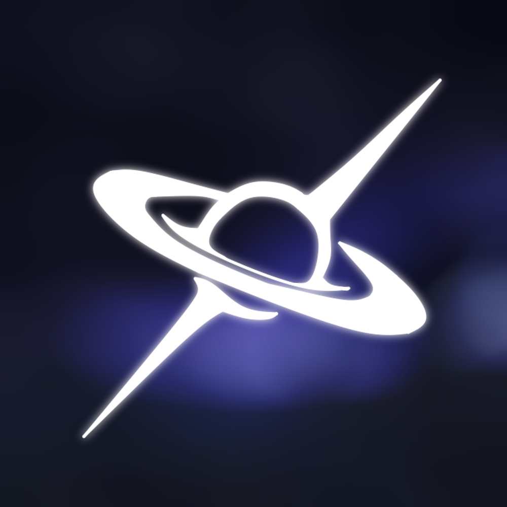

<div align="center">
  

  <h1>Pondus</h1>

  <p>
    <a href="https://modrinth.com/mod/pondus">
      
    </a>
    
    
    
  </p>

  <p>Custom gravity API for Minecraft, fork of Gravity Control.</p>
</div>

## Features
- Full 3D gravity control (six cardinal directions plus view‑relative)
- Per‑entity and per‑dimension gravity settings
- Status effect integration (strength, direction, invert)
- Simple command set (`/gravity` subcommands)
- Lightweight: no items or blocks – pure API

## Addon API
Pondus is designed as a library that other mods can depend on.  
Access the core functionality through `PondusAPI`:

```java
import dinner.dev.pondus.api.PondusAPI;
import dinner.dev.pondus.api.IEntityGravityData;
import net.minecraft.core.Direction;
import net.minecraft.world.entity.Entity;

// Get gravity data for an entity
IEntityGravityData gravity = PondusAPI.getGravityData(entity);

// Set base gravity direction
PondusAPI.setBaseGravityDirection(entity, Direction.UP);

// Set base gravity strength (multiplier)
PondusAPI.setBaseGravityStrength(entity, 1.5);

// Reset to vanilla defaults
PondusAPI.resetGravity(entity);

// Listen for gravity changes
@net.neoforged.bus.api.SubscribeEvent
public static void onGravityChange(dinner.dev.pondus.api.GravityUpdateEvent event) {
    Entity entity = event.getEntity();
    IEntityGravityData data = event.getData();
    // React to gravity changes here
}
```

## Requirements
- Minecraft 1.21.1
- NeoForge 21.1+

## License
This mod is licensed under the Creative Commons Attribution‑NonCommercial‑ShareAlike 4.0 International Public License (CC‑BY‑NC‑SA‑4.0).
